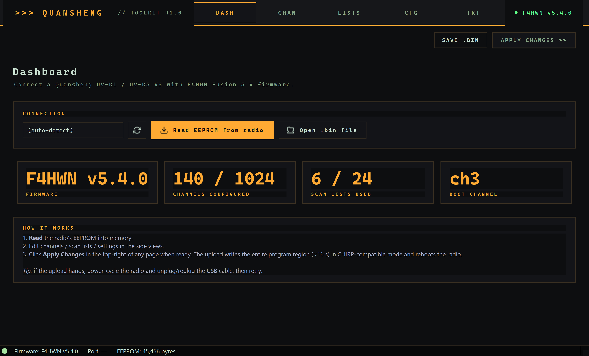

<div align="center">


# quansheng_toolkit

**Open-source desktop toolkit for Quansheng UV-K1, UV-K1(8) v3 Mini Kong and UV-K5 V3 radios.**

Channels • scan lists • settings • calibration • DTMF • boot logo • firmware flashing — from a polished PySide6 GUI or the CLI.

**Portable, single binary, fully offline** — bundles Python, Qt and 9 verified firmwares; no installer, no internet, no cloud.

[](LICENSE)
[](#install--from-source)
[](#download)
[](#download)
[](https://github.com/knoinok/quansheng_toolkit/releases)
[](#run-the-test-suite)
[](https://github.com/knoinok/quansheng_toolkit/wiki)

[**Download**](#download) · [**Quick start**](#quick-start) · [**Flashing firmware**](#flashing-firmware) · [**CLI**](#cli) · [**Roadmap**](#roadmap)



</div>

---

> [!WARNING]
> **This software has no real brain. Please use your own.** Use at your own risk. There is no guarantee it will work in any way on your radio, and certain operations (firmware flashing, calibration restore) can brick the device. The anti-brick allowlist limits — but does not eliminate — that risk. Back up your EEPROM and calibration before any write operation.

> [!NOTE]
> The toolkit covers the **PY32F071 family** (UV-K1, UV-K1(8) v3 Mini Kong, UV-K5 V3) end-to-end. The original DP32G030 family (UV-K5 / K5(8) / K6 / 5R+) shares enough of the EEPROM layout that read-only access should work, but isn't hardware-tested in this project. The Quansheng UV-TK11 "Taiko Kong" is on the roadmap.

## Table of contents

- [Highlights](#highlights)
- [Download](#download)
- [Supported hardware](#supported-hardware)
- [Quick start](#quick-start)
- [Flashing firmware](#flashing-firmware)
- [Install — from source](#install--from-source)
- [CLI](#cli)
- [Run the test suite](#run-the-test-suite)
- [Project layout](#project-layout)
- [Building distributable binaries](#building-distributable-binaries)
- [Roadmap](#roadmap)
- [License & credits](#license--credits)
- [Contributing](#contributing)

## Highlights

- **Fully offline, portable, no installer.** The Windows `.exe` (~71 MB) bundles the Python interpreter, Qt, the toolkit code and **all 9 firmware images** — drop it on a USB stick and you have a complete radio-maintenance kit you can plug into any PC at a hamfest, club meeting or field site without touching a network.
- **One-click flashing of bundled firmwares.** The Firmware tab ships **9 verified `.bin` images** — F4HWN open-source builds and Quansheng stock — with an anti-brick allowlist that refuses any combination not matching the live bootloader version.
- **Live LCD mirror over USB.** See the radio's screen in real time on the desktop, save PNG screenshots. Verified end-to-end on F4HWN UV-K1(8) v3 / UV-K5 V3.
- **CHIRP-compatible channel CSV.** Import and export the channel grid in the same 21-column format CHIRP uses, with scan-list assignments encoded in the `Comment` column for clean round-trip.
- **Calibration dump · verify · restore.** One-click backup of the per-unit RF trim, plus a Verify pass that re-reads the radio and diffs it byte-for-byte against the saved `.bin` so you know the dump is stable *before* you ever rely on it. Two-dialog confirmation on restore, profile-aware byte-count check, jump-to-region hex viewer.
- **DTMF contacts editor.** Full 16-slot phonebook at EEPROM `0x1C00`, with validated input (printable ASCII names, DTMF chars `0–9 A–D * #`).
- **Settings editor.** Every named setting in the F4HWN 5.x and stock registries (~110 entries combined), with live search, modified counter and one-click revert.
- **Read-only hex viewer** with jump-to-address and hex-pattern search — the right tool when you need to look at *something* the GUI doesn't surface yet.
- **Anti-brick DFU flash** — bootloader allowlist, three-stage confirmation, validated on UV-K5 V3 (F4HWN 4.3 / 5.4) and UV-K1 standard (F4HWN 5.4).
- **Cockpit-themed UI** (5 palette families × Light/Dark), wheel-edit guard on numeric fields so you don't accidentally change a value while scrolling the page.
- **377 offline tests** + CI on Windows / macOS / Linux × Python 3.11 / 3.12 / 3.13. No hardware needed for the test suite.

## Download

> [!TIP]
> **Windows users — easiest path.** A single self-contained `.exe` is published on every release. Python interpreter, Qt and all 9 bundled firmwares are embedded — no installer, no internet needed after download.

1. Open **[Releases](https://github.com/knoinok/quansheng_toolkit/releases)**.
2. Download `quansheng-toolkit.exe` from the latest tagged release (~71 MB).
3. Double-click to launch.

> [!NOTE]
> **First launch on Windows.** SmartScreen will warn about an "unrecognised publisher". Click **More info → Run anyway**. The binary isn't code-signed yet (signing certificates are paid; on the roadmap).

### Fully offline by design

The toolkit makes **zero network calls during normal operation** — read/write EEPROM, edit channels, flash firmware, dump calibration, mirror the LCD: everything happens locally. The bundled firmware images live inside the binary; the SHA-256 manifest is shipped with the package; even the help text is local.

The only thing that ever touches the network is **clicking a release-link** inside one of the firmware info cards (those open in your default browser, outside the toolkit).

This makes the toolkit ideal for:

- 🛠️ **Field maintenance** — a USB stick with `quansheng-toolkit.exe` is a complete portable kit
- 🛡️ **Air-gapped environments** — emergency-comms setups, restricted networks
- 🔒 **Privacy-conscious users** — your radio data never leaves your machine
- 🌐 **Bad-internet locations** — hamfests, contests in remote sites, basements

For macOS and Linux, build from source — see [Install — from source](#install--from-source). The from-source install needs the network only for `pip install`; after that it's fully offline too.

## Supported hardware

| Model | MCU | Firmware | Status |
|---|---|---|---|
| Quansheng UV-K1 | PY32F071 | F4HWN Fusion 5.x | ✅ read · write · settings · calibration · **DFU flash** |
| Quansheng UV-K1 | PY32F071 | Stock 7.03.x | ✅ read · write · settings · calibration |
| Quansheng UV-K1(8) v3 *Mini Kong* | PY32F071 + 2 MB SPI | F4HWN Fusion 5.x | ✅ read · write · settings · calibration *(verified end-to-end with V/M, ChName, ChDel)* |
| Quansheng UV-K5 V3 | PY32F071 | F4HWN Fusion 5.x | ✅ read · write · settings · calibration · DFU flash |
| Quansheng UV-K5 V3 | PY32F071 | Stock 7.00.x | ⚠️ read-only — firmware silently rejects writes (same on every open-source tool) |
| UV-K5 / K5(8) / K6 / 5R+ | DP32G030 | Stock | 🚧 same EEPROM layout as K5 V3 stock — should work read-only, hardware-untested |
| UV-TK11 *Taiko Kong* | TBD | TBD | 🚧 in roadmap |

## Quick start

1. Connect the radio via USB-C (K1 family) or CH340/CH9102 cable (K5 family).
2. Launch the toolkit:
   - **Windows:** double-click `quansheng-toolkit.exe`
   - **From source:** `python -m quansheng_toolkit.gui`
3. Open **Dashboard → Read EEPROM** to pull the radio's current state into memory.
4. Edit channels / scan lists / settings / DTMF contacts / boot logo as you like — every change is buffered locally, nothing is written to the radio yet.
5. Click **Apply Changes** (top-right of the window) to upload the modified image. The upload is **verified byte-for-byte against a re-read**; if any 64-byte block didn't persist, it's automatically retried.

> [!IMPORTANT]
> **Always do a Read first** before editing. The Dashboard shows the live image — if you edit before reading, you're working against an empty buffer and Apply will overwrite the radio with zeros.

## Flashing firmware

> [!CAUTION]
> Flashing is **destructive and irreversible**. The wrong firmware can brick the radio. The toolkit's allowlist verifies the bootloader version before allowing the flash, but if you bypass that with `Custom .bin`, you're on your own.

The Firmware tab guards the destructive flash path with **three layers of confirmation** and an **anti-brick allowlist** that refuses incompatible bootloader/firmware combinations.

**To flash:**

1. **Power off** the radio with the USB cable connected.
2. Hold **PTT + Side Key 2** while powering on. The LCD stays blank — that's bootloader (DFU) mode.
3. In the toolkit, click **Detect DFU bootloader**. The toolkit reads the bootloader version, identifies the radio, and filters the bundled-firmware dropdown to compatible builds.
4. Either pick a bundled firmware (F4HWN or Quansheng stock) and click **Flash selected bundled firmware**, or use **Custom .bin** for an external file.
5. Three confirmation dialogs (DFU reminder → optional file picker → last-chance confirm) before any byte is written.

**Validated combinations:**

| Radio | Bootloader | Firmware |
|---|---|---|
| UV-K5 V3 | 7.00.07 | F4HWN Fusion 4.3, 5.4 |
| UV-K1 standard | 7.03.01 | F4HWN Fusion 5.4 |
| UV-K1(8) v3 Mini Kong | 7.00.07 *(shared with K5 V3)* | F4HWN Fusion 5.4 |

## Install — from source

Required: Python 3.10 or newer.

<details>
<summary><strong>Windows</strong></summary>

```bat
git clone https://github.com/knoinok/quansheng_toolkit.git
cd quansheng_toolkit
py -3.13 -m pip install -r requirements.txt PySide6
py -3.13 -m quansheng_toolkit.gui
```

</details>

<details>
<summary><strong>macOS</strong></summary>

```bash
brew install python@3.13
git clone https://github.com/knoinok/quansheng_toolkit.git
cd quansheng_toolkit
python3 -m pip install -r requirements.txt PySide6
python3 -m quansheng_toolkit.gui
```

> [!NOTE]
> **CH340/CH9102 cable users:** install the WCH driver from <https://www.wch-ic.com/downloads/CH34XSER_MAC_ZIP.html>. The UV-K1's native USB-C bridge needs no driver.

</details>

<details>
<summary><strong>Linux (Debian / Ubuntu / Arch / Fedora)</strong></summary>

```bash
sudo apt install python3 python3-pip python3-venv     # or distro equivalent
git clone https://github.com/knoinok/quansheng_toolkit.git
cd quansheng_toolkit
python3 -m venv .venv && source .venv/bin/activate
pip install -r requirements.txt PySide6
python3 -m quansheng_toolkit.gui
```

Add yourself to the serial-port group:

```bash
sudo usermod -aG dialout $USER     # Debian/Ubuntu
sudo usermod -aG uucp $USER        # Arch/Fedora
# log out and back in
```

For a stable USB-C device name, drop a udev rule:

```bash
echo 'SUBSYSTEM=="tty", ATTRS{idVendor}=="36b7", ATTRS{idProduct}=="ffff", MODE="0660", GROUP="dialout", SYMLINK+="quansheng_uvk1"' | sudo tee /etc/udev/rules.d/99-quansheng.rules
sudo udevadm control --reload-rules && sudo udevadm trigger
```

</details>

## CLI

Every GUI feature is also available headless — handy for scripting and CI.

```bash
python -m quansheng_toolkit info             # handshake + firmware version
python -m quansheng_toolkit read -o cur.bin  # full EEPROM dump
python -m quansheng_toolkit list             # decode channels (live or --from-file)
python -m quansheng_toolkit show-settings    # every named setting
python -m quansheng_toolkit list-settings    # every key `make-bin --set k=v` accepts

# CSV-driven channel patch with scan-list assignment derived from the Comment column
python -m quansheng_toolkit make-bin -i cur.bin --csv ch.csv \
    --derive-from-comment -o patched.bin --show

python -m quansheng_toolkit apply-full --eeprom patched.bin

# Bootloader & DFU
python -m quansheng_toolkit dfu-info         # bootloader detection (DFU mode)
python -m quansheng_toolkit dfu-flash --eeprom firmware.bin --target k1 --yes-i-understand
```

## Run the test suite

```bash
pip install -e ".[dev]"
pytest -q
```

**377 unit tests** covering protocol framing, channel/settings encoders, DFU brick-protection, DTMF contacts, display-mirror parser, hex-dump formatter, firmware-bundle loader. **No hardware needed.** CI runs the full matrix on every push.

## Project layout

```
quansheng_toolkit/
├── kradio/                  # protocol, memory, settings, dfu, firmware
├── gui/                     # PySide6 app
│   ├── views/               # one tab per concern
│   ├── workers.py           # QThread workers for radio I/O
│   └── main_window.py
├── firmwares/               # bundled F4HWN + Quansheng .bin images
│   └── manifest.json        # sha256-pinned list, per-target metadata
├── assets/                  # app icon
├── cli.py                   # argparse subcommands
└── tests/                   # offline pytest suite
```

## Building distributable binaries

CI builds Windows and macOS artifacts on every `vX.Y.Z` tag and attaches them to a draft GitHub Release:

```bash
git tag v0.3.0
git push origin v0.3.0
# → dist/quansheng-toolkit.exe   (Windows)
# → dist/quansheng-toolkit       (macOS)
```

The Windows `.exe` includes Python 3.13, PySide6, the toolkit code and all 9 bundled firmwares — no separate downloads needed.

> [!NOTE]
> Linux is **not** built by CI right now. Linux users build [from source](#install--from-source) (the Linux steps take ~2 minutes on a fresh distro). PyInstaller produces a working Linux binary too — see the manual command below — but pinning the right Qt/EGL system libraries on every distro is fragile, so we ship from source instead.

To build locally:

```bash
pip install -e ".[dev,gui]" pillow
pyinstaller --onefile --windowed \
    --name quansheng-toolkit \
    --icon assets/quansheng-toolkit.ico \
    --collect-submodules quansheng_toolkit \
    --add-data "firmwares;firmwares" \
    --add-data "assets;assets" \
    launcher.py
```

(On macOS/Linux replace `;` with `:` in `--add-data`.)

## Roadmap

<details open>
<summary><strong>Done</strong></summary>

- [x] EEPROM read / write, channel decode, scan-list decode
- [x] Channel CSV import + export (CHIRP 21-column schema)
- [x] Settings registry covering F4HWN 5.4 (~76 entries) + Quansheng stock (~34 entries)
- [x] PySide6 GUI with cockpit themes (5 palette families × Light/Dark)
- [x] Channels view with two-stage tone editor and bulk-edit ribbon
- [x] Calibration dump + verify (re-read & diff) + restore with safety guards
- [x] DTMF contacts editor
- [x] Live LCD mirror (Display Mirror tab)
- [x] Hex viewer for diagnostics
- [x] Boot logo encoding (text 2×16 lines)
- [x] DFU bootloader Identify + firmware flash with anti-brick allowlist
- [x] Apply-full readback verify + retry on dropped blocks
- [x] Bundled firmware dropdown (F4HWN + Quansheng stock)
- [x] Single Windows `.exe` distribution
- [x] 377-test offline pytest suite
- [x] CI matrix Windows / macOS / Linux × Python 3.11 / 3.12 / 3.13

</details>

<details open>
<summary><strong>Open</strong></summary>

- [ ] Quansheng UV-TK11 *Taiko Kong* profile (no hardware on hand yet)
- [ ] K5(8) / K6 / 5R+ (DP32G030) hardware-test of the existing memory module
- [ ] K1 stock memory layout cross-check across firmware revisions
- [ ] Code-signing certificate for the Windows `.exe` to clear SmartScreen
- [ ] Linux AppImage single-binary distribution
- [ ] Italian / French / Spanish translations of the GUI

</details>

<details>
<summary><strong>Future firmware support placeholders</strong></summary>

- [ ] **fagci** — alternative custom firmware for K5
- [ ] **IJV X360** — 999-channel K5 variant
- [ ] **joaquim** — F4HWN predecessor with display-mirror protocol
- [ ] **TK11 graphic boot logo editor** — TK11 stores a 128×64 monochrome logo at SPI flash `0x0D6008`

</details>

## License & credits

This project is licensed under **Apache-2.0** — see [LICENSE](LICENSE) and [NOTICE](NOTICE).

| Dependency / influence | Author | Role |
|---|---|---|
| **F4HWN firmware** | [@armel](https://github.com/armel) and contributors | The custom firmware that makes most of these features possible. Bundled `.bin` images are unmodified copies of upstream releases. <br/>• [armel/uv-k1-k5v3-firmware-custom](https://github.com/armel/uv-k1-k5v3-firmware-custom) (PY32F071) <br/>• [armel/uv-k5-firmware-custom](https://github.com/armel/uv-k5-firmware-custom) (DP32G030). Apache-2.0. |
| **Quansheng** | manufacturer | Radios + stock firmware (proprietary, freely distributed at [qsfj.com](https://en.qsfj.com/support/downloads/)), bundled unmodified. |
| **CHIRP** | Dan Smith (kk7ds) | The channel CSV format we read/write is the same CHIRP exports. |
| **muzkr / amnemonic** | reverse-engineering | Original K5/K1 protocol references the toolkit's protocol layer is implemented against. |
| **DualTachyon** | original community work | Released the very first open-source firmware for the UV-K5 — none of this would exist without that initial work. |

## Contributing

Read [`CONTRIBUTING.md`](CONTRIBUTING.md) for:

- the **radio-safety policy** (no destructive operation without explicit user confirmation; the anti-brick allowlist is sacrosanct);
- the bootloader-mapping process for new radios;
- the F4HWN channel-attribute trap that cost an evening of debugging on the UV-K1(8) v3 (`band=7` marks an empty slot — encoding the actual band 0–6 from frequency is mandatory for the radio to recognise channels).

Bug reports and feature requests welcome via [Issues](https://github.com/knoinok/quansheng_toolkit/issues). For longer discussions, use [Discussions](https://github.com/knoinok/quansheng_toolkit/discussions).
